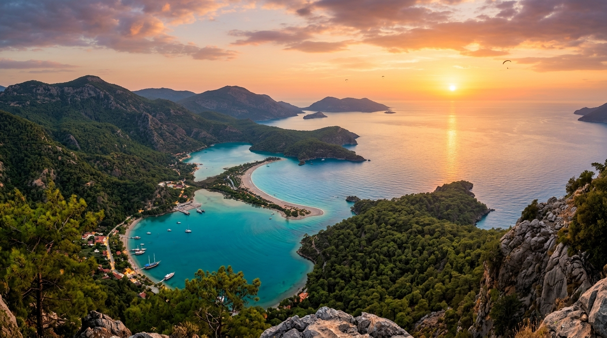

# 📍 Mugla - Seyahat ve Tefekkür Notları

## 📜 Şehrin Ruhu
> "Mavinin yeşille kavuştuğu bu kıyılar, ruhunu dinlendirmek isteyen her seyyah için bir sığınaktır."
> "Antik Likya ve Karia medeniyetlerinin gölgesinde, turkuaz suların zümrüt ormanlarla seviştiği ebedi mavi yolculuk."

### 🌍 Şehrin Dokusu ve Hatırası
Ege ve Akdeniz'in kucaklaştığı, her koyunda başka bir efsanenin saklandığı Muğla. Antik kalıntıları, el değmemiş doğası ve uçsuz bucaksız koyları ile burası sadece bir yaz tatili rotası değil; tarihin ve doğanın en cömert birleşimidir. Fethiye'deki Ölüdeniz'in o kıpırtısız sakinliğinden, Kayaköy'ün hüzünlü hayalet sokaklarına uzanan bu yolculuk, insanın iç dünyasında da yeni kapılar aralar.

### 🕊️ Gezginin Not Defterinden (İçsel Düşünceler)
Kayaköy'ün terk edilmiş taş evleri arasında rüzgarın uğultusunu dinlemek, insan yapımı her şeyin geçiciliğini ve sessizliğin sesini öğretir. Doğanın insan elinin çekildiği yerleri nasıl yavaşça geri aldığını görmek, kibirden uzaklaşmak için muhteşem bir derstir. Muğla'nın turkuaz suları ise ruhu arındıran, berraklaştıran manevi bir ayna gibidir.

### 🍽️ Yöresel Lezzet Tavsiyeleri
- **Muğla Köftesi:** İçi sulu, az baharatlı, yanında közlenmiş biber ve domatesle sunulan lezzet.
- **Çökertme Kebabı:** İncecik çıtır patatesler üzerinde yoğurt ve sosla sunulan et şöleni.
- **Kabak Çiçeği Dolması:** Sabahın ilk ışıklarında toplanan taze kabak çiçeklerinin pirinçle buluştuğu Ege başyapıtı.

### ⛺ Konaklama ve Bütçe Stratejisi
- **Sıfır Konaklama Maliyeti:** GSB Seyahatsever projesi kapsamında şehirdeki KYK yurtlarında 5 gün ücretsiz konaklanmıştır.
- **Ulaşım Optimizasyonu:** Bir önceki ilden rotaya devam edilerek yol masrafı minimize edilmiştir.

### 💻 Yarı Göçebe Mesaisi (Upskilling)
- **Kütüphane Rutini:** Gündüzleri İl Halk Kütüphanesinde zaman geçirilerek yazılım projeleri geliştirilmiş ve eğitimlere devam edilmiştir.
- **Şehri Sindirme:** Kalan vakitlerde şehrin tarihi ve kültürel dokusu acele etmeden, derinlemesine keşfedilmiştir.

### ✨ Keşfedilesi Duraklar
Bu şehrin havasını solumak, ruhuna dokunmak için mutlaka adımlanması gereken köşe taşları:
- [ ] **Ölüdeniz**
- [ ] **Kayaköy**
- [ ] **Saklıkent Kanyonu**
- [ ] **Kral Kaya Mezarları (Dalyan)**
- [ ] **Sedir Adası (Kleopatra Plajı)**
- [ ] **Bodrum Kalesi**

---
*Bu il bizzat deneyimlenmiş, yolları aşındırılmış ve seyahatnameye sevgiyle işlenmiştir.* ✅
