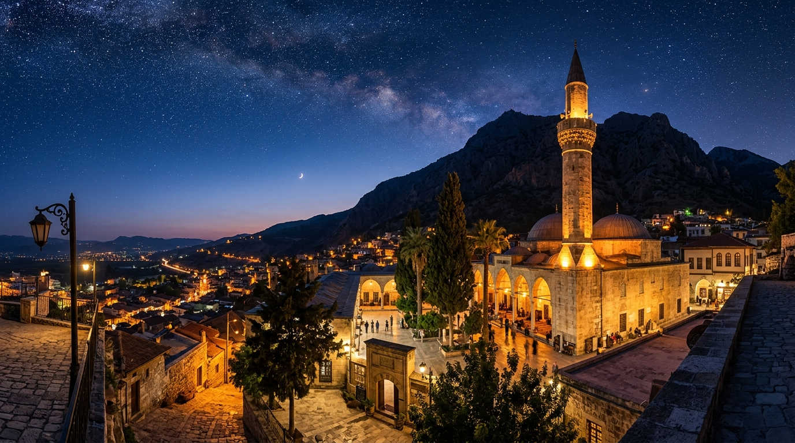

# 📍 Hatay - Seyahat ve Tefekkür Notları

## 📜 Şehrin Ruhu
> "Medeniyetlerin ve inançların ortak sofrasında buluşan Hatay, barışın ve kardeşliğin ebedi yurdudur."
> "Tarihin en eski caddelerinde farklı ezan, çan ve hazzan seslerinin birbirine karıştığı hoşgörü bahçesi."

### 🌍 Şehrin Dokusu ve Hatırası
Tarih boyunca 'Doğu'nun Kraliçesi' olarak anılan, Asi Nehri'nin tersine akışıyla nam saldığı kadim Antakya toprakları. Hatay, Hristiyanlığın ilk kiliselerinden St. Pierre'e, Anadolu'nun ilk camilerinden Habib-i Neccar'a ev sahipliği yapan, inançların ve kültürlerin binlerce yıldır barış içinde yan yana yaşadığı eşsiz bir mozaiktir. Sokaklarında yürürken Roma döneminden kalma taş sütunların izlerine rastlayabilir, dünyanın en zengin mozaik müzelerinden birinde zaman yolculuğuna çıkabilirsiniz. Hatay, her kültürden, her dilden ve her inançtan insanın ortak bir çatı altında kardeşçe yaşayabileceğinin en somut ve asil kanıtıdır.

### 🕊️ Gezginin Not Defterinden (İçsel Düşünceler)
Habib-i Neccar Camii'nin sessizliğinde oturup, hakikati haykıran o ilk inananların hikayesini düşünmek, ruha derin bir teslimiyet ve huzur aşılar. Farklı dinlerin tapınaklarının neredeyse sırt sırta verdiği bu şehir, insana 'yaradılanı severim Yaradan'dan ötürü' felsefesinin en somut halini gösterir. Asi Nehri'nin tersine akması gibi, buradaki manevi iklim de insana dünyanın bencil ve maddeci akışına karşı durmayı, sevgi ve barış yolunda tersine kürek çekmeyi öğretir.

### 🍽️ Yöresel Lezzet Tavsiyeleri
- **Antakya Künefesi:** Tuzsuz özel künefe peyniri, tel kadayıf ve sıcacık şerbetin közde pişen efsanesi.
- **Tepsi Kebabı:** Zırh kıymasının baharatlar ve sosla fırın tepsisinde ağır ağır pişmesiyle oluşan şaheser.
- **Humus:** Bol tahin, kimyon ve zeytinyağıyla sunulan, ılık ve enfes bir Akdeniz klasiği.

### ⛺ Konaklama ve Bütçe Stratejisi
- **Sıfır Konaklama Maliyeti:** GSB Seyahatsever projesi kapsamında şehirdeki KYK yurtlarında 5 gün ücretsiz konaklanmıştır.
- **Ulaşım Optimizasyonu:** Bir önceki ilden rotaya devam edilerek yol masrafı minimize edilmiştir.

### 💻 Yarı Göçebe Mesaisi (Upskilling)
- **Kütüphane Rutini:** Gündüzleri İl Halk Kütüphanesinde zaman geçirilerek yazılım projeleri geliştirilmiş ve eğitimlere devam edilmiştir.
  * *Seyyahın Kütüphane Notu:* Hatay İl Halk Kütüphanesi - Tarihi dokusuyla ilham verici, sessiz çalışma odaları tefekkür ve kodlama için çok uygun.
- **Şehri Sindirme:** Kalan vakitlerde şehrin tarihi ve kültürel dokusu acele etmeden, derinlemesine keşfedilmiştir.

### ✨ Keşfedilesi Duraklar
Bu şehrin havasını solumak, ruhuna dokunmak için mutlaka adımlanması gereken köşe taşları:
- [ ] **Habib-i Neccar Camii**
- [ ] **St. Pierre Kilisesi**
- [ ] **Hatay Arkeoloji Müzesi**
- [ ] **Titus Tüneli ve Beşikli Mağara**
- [ ] **Tarihi Antakya Sokakları**
- [ ] **Harbiye Şelaleleri**

---
*Bu il bizzat deneyimlenmiş, yolları aşındırılmış ve seyahatnameye sevgiyle işlenmiştir.* ✅
