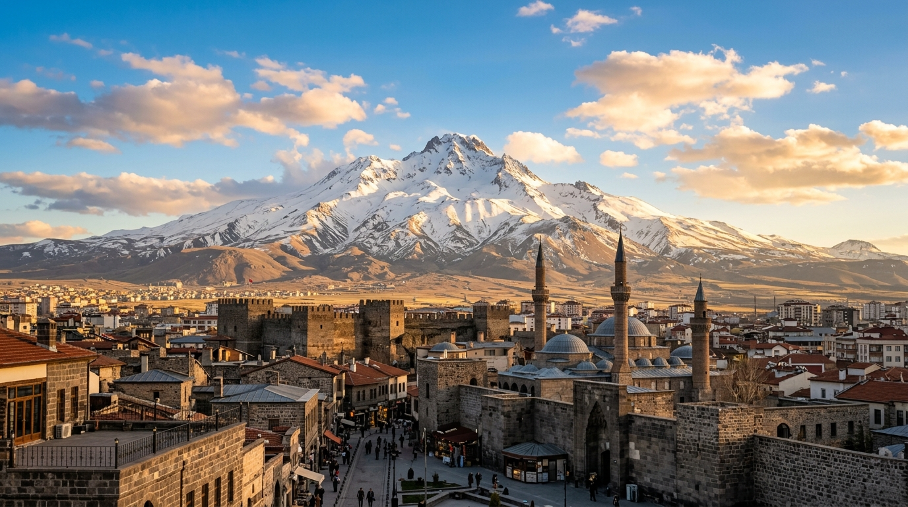

# 📍 Kayseri - Seyahat ve Tefekkür Notları

## 📜 Şehrin Ruhu
> "Erciyes'in beyaz zirvesi, toprağın bağrındaki ticaret yollarını gözetleyen mağrur bir gözcü gibidir."
> "Erciyes'in gölgesinde yükselen, Selçuklu mirası taş binalarla bezenmiş ticaretin ve zanaatin kadim merkezi."

### 🌍 Şehrin Dokusu ve Hatırası
Erciyes Dağı'nın heybetli eteklerinde kurulu, Hititlerden Selçuklulara uzanan zengin bir ticaret ve kültür kavşağı Kayseri. Gevher Nesibe Şifahanesi gibi tıp tarihindeki eşsiz Selçuklu eserleri, Talas'ın tarihi taş sokakları ve Hunat Hatun Külliyesi ile şehir, geçmişin zarafetini taşımaktadır. Aynı zamanda bozkırın ortasında sanayi ve girişimcilik ruhunu en üst düzeyde yaşatan, çalışmanın ve üretmenin ibadete dönüştüğü vakur bir menzildir.

### 🕊️ Gezginin Not Defterinden (İçsel Düşünceler)
Erciyes'in dumanlı zirvesine Hunat Hatun Külliyesi'nin avlusundan bakmak, insana dünya telaşının gelip geçici olduğunu, kalıcı olanın ise arkada bırakılan hayırlı eserler ve samimiyet olduğunu hatırlatır. Gevher Nesibe'nin taşa kazınmış şifa formüllerinde, hem bedeni hem ruhu tedavi eden o derin Selçuklu felsefesini tefekkür edersiniz.

### 🍽️ Yöresel Lezzet Tavsiyeleri
- **Kayseri Mantısı:** Bir kaşığa kırk adet sığdırılan, el emeği göz nuru sarımsaklı yoğurtlu ve sumaklı başyapıt.
- **Kayseri Pastırması:** Çemen kokulu, Erciyes rüzgarıyla kurutulmuş, incecik dilimlenen geleneksel et sanatı.
- **Kayseri Yağlaması (Şebit):** İncecik açılmış hamurların arasına kıymalı harç dökülerek üst üste dizilen lezzet şöleni.

### ⛺ Konaklama ve Bütçe Stratejisi
- **Sıfır Konaklama Maliyeti:** GSB Seyahatsever projesi kapsamında şehirdeki KYK yurtlarında 5 gün ücretsiz konaklanmıştır.
- **Ulaşım Optimizasyonu:** Bir önceki ilden rotaya devam edilerek yol masrafı minimize edilmiştir.

### 💻 Yarı Göçebe Mesaisi (Upskilling)
- **Kütüphane Rutini:** Gündüzleri İl Halk Kütüphanesinde zaman geçirilerek yazılım projeleri geliştirilmiş ve eğitimlere devam edilmiştir.
  * *Seyyahın Kütüphane Notu:* Kayseri Milli Mücadele Müzesi Kütüphanesi veya Kayseri Merkez Kütüphanesi - Tarihi taş atmosferi ve modern sessiz çalışma alanlarıyla seyyah yazılımcılar için muhteşem odaklanma imkanı sunar.
- **Şehri Sindirme:** Kalan vakitlerde şehrin tarihi ve kültürel dokusu acele etmeden, derinlemesine keşfedilmiştir.

### ✨ Keşfedilesi Duraklar
Bu şehrin havasını solumak, ruhuna dokunmak için mutlaka adımlanması gereken köşe taşları:
- [ ] **Erciyes Dağı**
- [ ] **Hunat Hatun Külliyesi**
- [ ] **Gevher Nesibe Şifahiye ve Gıyasiye Medresesi (Selçuklu Uygarlığı Müzesi)**
- [ ] **Talas Tarihi Mahallesi**
- [ ] **Kayseri Kalesi**
- [ ] **Kapuzbaşı Şelaleleri**

---
*Bu il bizzat deneyimlenmiş, yolları aşındırılmış ve seyahatnameye sevgiyle işlenmiştir.* ✅
