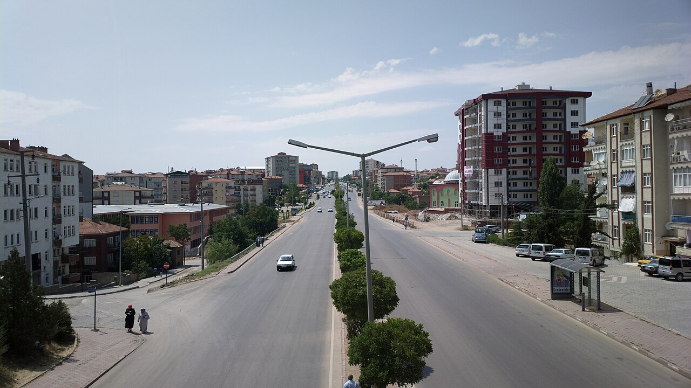

# 📍 Kırıkkale - Seyahat ve Tefekkür Notları

## 📜 Şehrin Ruhu
> "Kızılırmak'ın kıvrılan kolları, bozkıra hayat taşımaya çalışan sabırlı damarlar gibidir."
> "Cumhuriyet'in sanayi hamlesiyle şekillenen, Kızılırmak'ın serin esintisi altında bozkırın dinç duruşlu kenti."

### 🌍 Şehrin Dokusu ve Hatırası
Kırıkkale, Cumhuriyet döneminde kurulan sanayi tesisleri ve özellikle savunma sanayii yatırımlarıyla gelişim gösteren dinamik bir Anadolu şehridir. Kızılırmak nehri üzerinde yer alan tarihi Çeşnigir Köprüsü ve çevresindeki kanyon, şehrin doğayla kucaklaştığı en özel köşelerden biridir. Aynı zamanda Hasandede Camii ve Türbesi gibi manevi duraklarıyla bozkırın dingin ve vakur ruhunu barındırır.

### 🕊️ Gezginin Not Defterinden (İçsel Düşünceler)
Çeşnigir Köprüsü'nün asırlık taş kemerlerinden akan Kızılırmak'a bakmak, suyun akışı gibi zamanın ve ömrün de durmaksızın akıp gittiğini, önemli olanın ardında yıkılmayan köprüler gibi sağlam eserler bırakabilmek olduğunu hatırlatır. Hasandede'nin sevgi ve hoşgörü dolu öğretisi bozkırın sıcağında ruhu ferahlatır.

### 🍽️ Yöresel Lezzet Tavsiyeleri
- **Kırıkkale Tava (Kara Tava):** Közlenmiş biber ve domates eşliğinde fırınlanan, yöreye özgü kuzu eti lezzeti.
- **Kömbe:** Sac üzerinde pişen, içi bol tereyağlı ve çıtır katmerli geleneksel börek.
- **Hasandede Üzümü:** Yörenin verimli topraklarında yetişen, ince kabuklu ve tatlı meşhur üzüm.

### ⛺ Konaklama ve Bütçe Stratejisi
- **Sıfır Konaklama Maliyeti:** GSB Seyahatsever projesi kapsamında şehirdeki KYK yurtlarında 5 gün ücretsiz konaklanmıştır.
- **Ulaşım Optimizasyonu:** Ankara-Kırıkkale yakınlığından faydalanılarak ulaşım bütçesi minimumda tutulmuştur.

### 💻 Yarı Göçebe Mesaisi (Upskilling)
- **Kütüphane Rutini:** Gündüzleri İl Halk Kütüphanesinde zaman geçirilerek yazılım projeleri geliştirilmiş ve eğitimlere devam edilmiştir.
  * *Seyyahın Kütüphane Notu:* Kırıkkale İl Halk Kütüphanesi - Sakin çalışma ortamı ve modern kaynaklarıyla bozkırın ortasında seyyah yazılımcılar için huzurlu ve verimli bir çalışma durağıdır.
- **Şehri Sindirme:** Kalan vakitlerde Kızılırmak kenarında yürüyüşler yapılmış ve bozkırın sessizliği tefekkür edilmiştir.

### ✨ Keşfedilesi Duraklar
Bu şehrin havasını solumak, ruhuna dokunmak için mutlaka adımlanması gereken köşe taşları:
- [ ] **Çeşnigir Köprüsü ve Kanyonu**
- [ ] **Hasandede Camii ve Türbesi**
- [ ] **MKE Silah Sanayi Müzesi**
- [ ] **Celal Bayar Parkı**
- [ ] **Karaahmetli Tabiat Parkı**

---
*Bu il bizzat deneyimlenmiş, yolları aşındırılmış ve seyahatnameye sevgiyle işlenmiştir.* ✅
