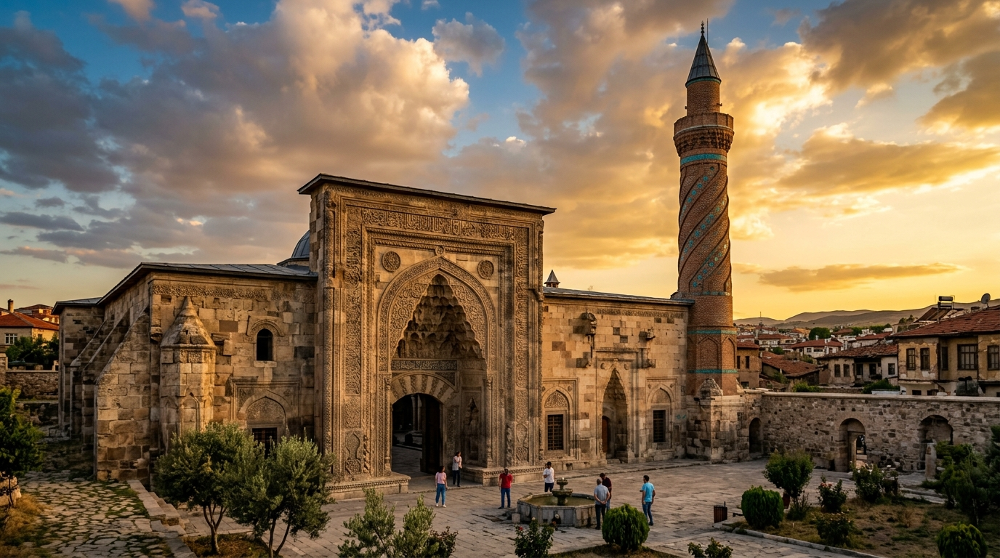

# 📍 Kirsehir - Seyahat ve Tefekkür Notları

## 📜 Şehrin Ruhu
> "Gönülden gönüle giden o gizli yolu bulamayanlar, bozkırın ortasında yönünü şaşırmış yolcular gibidir."
> "Ahilik teşkilatının kurulduğu, gönül tellerine dokunan ozanların sazıyla yankılanan bilgeliğin ve hoşgörünün beşiği."

### 🌍 Şehrin Dokusu ve Hatırası
Anadolu bozkırının en samimi köşelerinden biri olan Kırşehir, esnaf ahlakının temeli olan Ahilik teşkilatının kurucusu Ahi Evran'ın ve gönül dünyamızı zenginleştiren Neşet Ertaş ile Muharrem Ertaş gibi ulu ozanların yurdudur. Cacabey Medresesi'nin gökbilim rasathanesi olarak tasarlanan minaresiyle bilimin, Ahi Evran Veli Camii ile ahlakın ve dürüstlüğün harmanlandığı bu şehir, gösterişten uzak manevi zenginliğiyle insanı sarıp sarmalar.

### 🕊️ Gezginin Not Defterinden (İçsel Düşünceler)
Cacabey Medresesi'nin göğe uzanan taş sütunlarında Selçuklu'nun evreni anlama, yıldızları okuma arzusunu hissedersiniz. Ahiliğin cömertlik, dürüstlük ve paylaşım kuralları, günümüz dijital dünyasındaki açık kaynak (open source) felsefesinin asırlar önceki manevi atası gibidir. Neşet Ertaş'ın mezarında yankılanan 'Aşk bezirganı' felsefesiyle ruhunuz arınır.

### 🍽️ Yöresel Lezzet Tavsiyeleri
- **Kırşehir Çullaması:** Tavuk eti ve unun tereyağıyla buluştuğu, üzerine gezdirilen pul biberli yağla sunulan geleneksel lezzet.
- **Cacabey Çorbası:** Süzme yoğurt, buğday ve nohutla yapılan, naneyle tatlandırılan serinletici çorba.
- **Kırşehir Köftesi:** Yöresel baharatlarla hazırlanan, içi sulu dışı çıtır esnaf köftesi.

### ⛺ Konaklama ve Bütçe Stratejisi
- **Sıfır Konaklama Maliyeti:** GSB Seyahatsever projesi kapsamında şehirdeki KYK yurtlarında 5 gün ücretsiz konaklanmıştır.
- **Ulaşım Optimizasyonu:** Bir önceki ilden rotaya devam edilerek yol masrafı minimize edilmiştir.

### 💻 Yarı Göçebe Mesaisi (Upskilling)
- **Kütüphane Rutini:** Gündüzleri İl Halk Kütüphanesinde zaman geçirilerek yazılım projeleri geliştirilmiş ve eğitimlere devam edilmiştir.
  * *Seyyahın Kütüphane Notu:* Kırşehir İl Halk Kütüphanesi - Sakin ortamı ve geniş kaynak yelpazesi ile bozkırda sessizce kod yazıp üretmek için ideal bir liman.
- **Şehri Sindirme:** Kalan vakitlerde şehrin tarihi ve kültürel dokusu acele etmeden, derinlemesine keşfedilmiştir.

### ✨ Keşfedilesi Duraklar
Bu şehrin havasını solumak, ruhuna dokunmak için mutlaka adımlanması gereken köşe taşları:
- [ ] **Cacabey Medresesi (Gökbilim Medresesi)**
- [ ] **Ahi Evran Veli Camii ve Türbesi**
- [ ] **Neşet Ertaş Müzesi ve Kabri**
- [ ] **Seyfe Gölü Kuş Cenneti**
- [ ] **Kent Park**
- [ ] **Aşıkpaşa Türbesi**

---
*Bu il bizzat deneyimlenmiş, yolları aşındırılmış ve seyahatnameye sevgiyle işlenmiştir.* ✅
