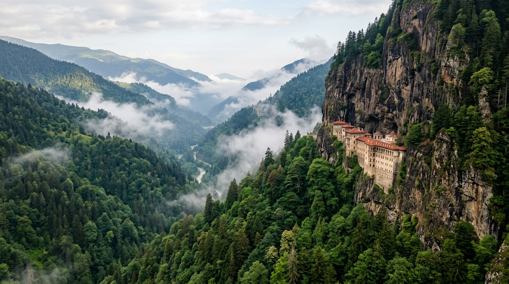

# 📍 Trabzon - Seyahat ve Tefekkür Notları

## 📜 Şehrin Ruhu
> "Sarp kayalıkların sinesine kurulan mabetler, inancın hiçbir engel tanımadığının en somut nişanesidir."
> "Hırçın dalgaların vurduğu kıyılardan, sisler altındaki yemyeşil yaylalara uzanan, tarihin vakur limanı."

### 🌍 Şehrin Dokusu ve Hatırası
Karadeniz'in hırçın suları ile sarp dağlarının arasında kurulmuş kadim liman şehri. Trabzon, Zigana Dağları'nın sisli geçitlerinden süzülen Karadeniz kültürünün, kemençe sesinin ve horon coşkusunun merkezidir. Karadağ'ın dik yamaçlarına adeta bir kartal yuvası gibi kondurulmuş bin 600 yıllık Sümela Manastırı, inancın sarp dağları nasıl aşabileceğinin en büyüleyici kanıtıdır. Hamsi kokan sokakları, yemyeşil yaylaları ve tarihi yapılarıyla Trabzon, Karadeniz'in ruhunu en derin hissettiren kentidir.

### 🕊️ Gezginin Not Defterinden (İçsel Düşünceler)
Sümela Manastırı'nın Karadağ yamaçlarındaki o dik, sarp ve sisli yolunu adımlamak, hakikate giden yolun da meşakkatli ama ulaşıldığında o derece ferahlatıcı olduğunu hissettirir. Doğu Karadeniz'in geçit vermez dağları, insana tabiat karşısındaki acziyetini hatırlatarak tevazuyu öğretir. Kemençenin o kıvrak, hırçın ama bir o kadar da dertli sesi, bu toprakların insanının neşesini ve hüznünü aynı anda içinde barındıran kalbinin yansımasıdır.

### 🍽️ Yöresel Lezzet Tavsiyeleri
- **Trabzon Akçaabat Köftesi:** Bol sarımsaklı ve özel dana kıymasıyla yapılan, ızgarada pişen efsane köfte.
- **Kuymak (Muhlama):** Kolot peyniri, mısır unu ve tereyağının uzayıp giden o nefis lezzet senfonisi.
- **Hamsili Pilav:** Fırında nar gibi kızarmış hamsilerin mısır ekmeği ve baharatlı pilavla buluşması.

### ⛺ Konaklama ve Bütçe Stratejisi
- **Sıfır Konaklama Maliyeti:** GSB Seyahatsever projesi kapsamında şehirdeki KYK yurtlarında 5 gün ücretsiz konaklanmıştır.
- **Ulaşım Optimizasyonu:** Bir önceki ilden rotaya devam edilerek yol masrafı minimize edilmiştir.

### 💻 Yarı Göçebe Mesaisi (Upskilling)
- **Kütüphane Rutini:** Gündüzleri İl Halk Kütüphanesinde zaman geçirilerek yazılım projeleri geliştirilmiş ve eğitimlere devam edilmiştir.
- **Şehri Sindirme:** Kalan vakitlerde şehrin tarihi ve kültürel dokusu acele etmeden, derinlemesine keşfedilmiştir.

### ✨ Keşfedilesi Duraklar
Bu şehrin havasını solumak, ruhuna dokunmak için mutlaka adımlanması gereken köşe taşları:
- [ ] **Sümela Manastırı**
- [ ] **Trabzon Ayasofya Camii**
- [ ] **Uzungöl**
- [ ] **Atatürk Köşkü**
- [ ] **Hıdırnebi Yaylası**
- [ ] **Boztepe Seyir Terası**

---
*Bu il bizzat deneyimlenmiş, yolları aşındırılmış ve seyahatnameye sevgiyle işlenmiştir.* ✅
