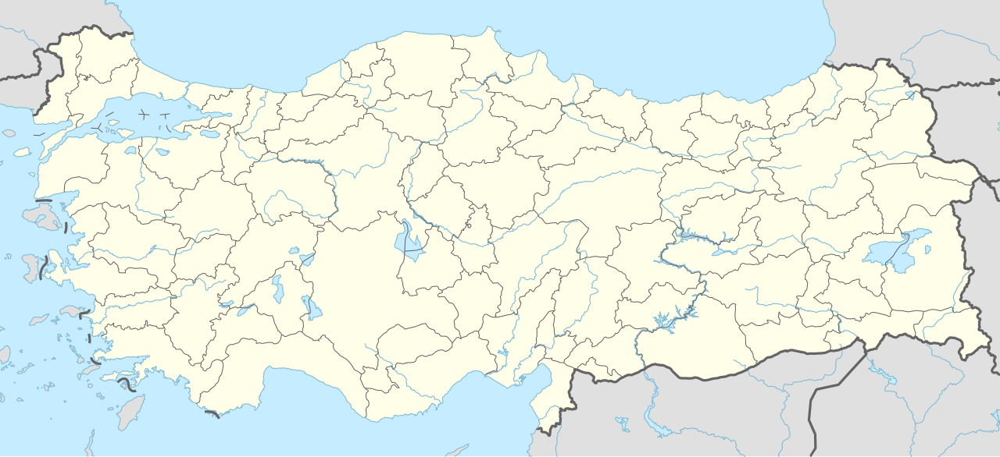

# 📍 Agri - Seyahat ve Tefekkür Notları

## 📜 Şehrin Ruhu
> "Ağrı Dağı'nın bulutları aşan heybeti, insana kendi küçüklüğünü ve yaratıcının büyüklüğünü hatırlatan sessiz bir mabettir."
> "Doğunun sınır çizgisinde, İshak Paşa Sarayı'nın masalsı silüetinin Ağrı Dağı'nın karlarıyla buluştuğu yüksek diyar."

### 🌍 Şehrin Dokusu ve Hatırası
Türkiye'nin ve Avrupa'nın en yüksek zirvesi olan Ağrı Dağı'nın adını taşıyan, sınırlerin ve karlı dağların şehri Ağrı. Doğubayazıt ilçesinde, sarp kayalıkların üzerine adeta bir kartal yuvası gibi kurulmuş olan 18. yüzyıl Osmanlı şaheseri İshak Paşa Sarayı, Türk mimarlık tarihinin en görkemli yapılarından biridir. Şehir, sert iklimine rağmen misafirperver insanları ve kadim tarihiyle dikkat çeker.

### 🕊️ Gezginin Not Defterinden (İçsel Düşünceler)
İshak Paşa Sarayı'nın avlusunda durup aşağıdaki ovayı izlemek, dünyadaki krallıkların ve sarayların geçiciliğini, asıl kalıcı olanın ise sadece yaradanın yüceliği olduğunu derinden hissettirir. Ağrı Dağı'nın dumanlı zirvesine bakmak, dervişlerin manevi basamakları aşarak ulaştıkları o yüksek mertebeleri ve içsel zirveleri sembolize eder. Soğuk bozkır havası, zihni berraklaştıran ve içsel bir tefekküre davet eden bir atmosfere sahiptir.

### 🍽️ Yöresel Lezzet Tavsiyeleri
- **Abdigör Köftesi:** Doğubayazıt yöresine ait, taş üzerinde tokmakla dövülerek yapılan çok lezzetli ve hafif köfte.
- **Ağrı Halisesi:** Tandırda uzun süre pişen buğday ve kemiksiz etin dövülerek bulamaç haline getirilmesi.
- **Kete:** Doğu Anadolu'nun geleneksel içli veya sade fırınlanmış hamur işi lezzeti.

### ⛺ Konaklama ve Bütçe Stratejisi
- **Sıfır Konaklama Maliyeti:** GSB Seyahatsever projesi kapsamında şehirdeki KYK yurtlarında 5 gün ücretsiz konaklanmıştır.
- **Ulaşım Optimizasyonu:** Bir önceki ilden rotaya devam edilerek yol masrafı minimize edilmiştir.

### 💻 Yarı Göçebe Mesaisi (Upskilling)
- **Kütüphane Rutini:** Gündüzleri İl Halk Kütüphanesinde zaman geçirilerek yazılım projeleri geliştirilmiş ve eğitimlere devam edilmiştir.
  * *Seyyahın Kütüphane Notu:* Ağrı İl Halk Kütüphanesi - Soğuk Doğu ikliminde sıcak bir çalışma ortamı sunan, modern donanımlı kütüphane.
- **Şehri Sindirme:** Kalan vakitlerde şehrin tarihi ve kültürel dokusu acele etmeden, derinlemesine keşfedilmiştir.

### ✨ Keşfedilesi Duraklar
Bu şehrin havasını solumak, ruhuna dokunmak için mutlaka adımlanması gereken köşe taşları:
- [ ] **İshak Paşa Sarayı**
- [ ] **Ağrı Dağı Milli Parkı**
- [ ] **Doğubayazıt Kalesi**
- [ ] **Meteor Çukuru**
- [ ] **Nuh'un Gemisi İzleri**
- [ ] **Diyadin Kaplıcaları**

---
*Bu il bizzat deneyimlenmiş, yolları aşındırılmış ve seyahatnameye sevgiyle işlenmiştir.* ✅
