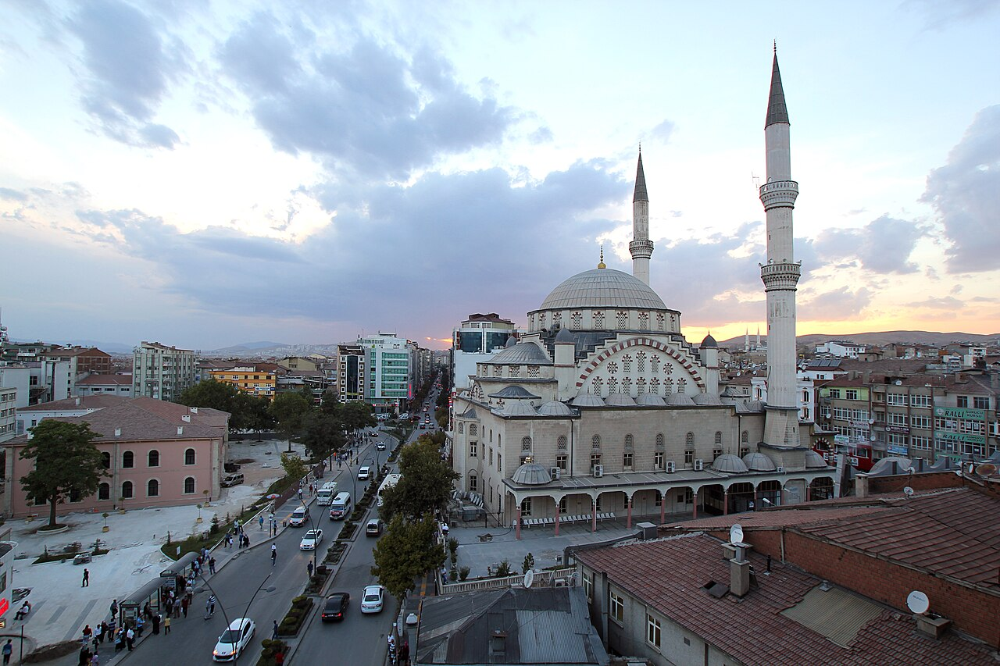

# 📍 Elazig - Seyahat ve Tefekkür Notları

## 📜 Şehrin Ruhu
> "Harput'un bin yıllık taş surları, medeniyetlerin yükselip alçaldığı ama maneviyatın hep ayakta kaldığı bir kaledir."
> "Tarihi Harput Kalesi'nin gölgesinde, Hazar Gölü'nün batık şehrine bakan köklü medeniyetlerin ve gakgoşların yurdu."

### 🌍 Şehrin Dokusu ve Hatırası
Kadim Harput kentinin mirasçısı, baraj gölleriyle çevrili Doğu Anadolu kenti Elazığ. Harput Kalesi'nin eğik minaresi, Hazar Gölü'nün suları altındaki antik Batık Şehir ve şifalı Buzluk Mağarası ile burası tarihi ve doğal sürprizlerle doludur. Kendine has musikisi (kürsübaşı sohbetleri) ve 'gakgoş' kültürüyle son derece misafirperverdir.

### 🕊️ Gezginin Not Defterinden (İçsel Düşünceler)
Harput Ulu Camii'nin İtalya'daki Pisa Kulesi'nden daha eğik olan minaresinin altında durup onun yüzyıllardır yıkılmadan duran dengesini izlemek, ilahi korumanın ve dengenin manevi bir sembolüdür. Hazar Gölü'nün berrak sularına gömülmüş o antik şehrin kalıntıları, suların altındaki geçip gitmiş hayatlar üzerine hüzünlü bir tefekkür sunar.

### 🍽️ Yöresel Lezzet Tavsiyeleri
- **Harput Köftesi:** İnce bulgur, kıyma ve reyhan otunun yoğrularak salçalı suda pişirilmesiyle yapılan yemek.
- **Orcik:** İpe dizilen cevizlerin sıcak üzüm şırasına batırılarak kurutulmasıyla yapılan şifalı tatlı.
- **Gömme:** Fırında kömür ateşinde pişen, içi kıymalı ve tereyağlı geleneksel ekmek yemeği.

### ⛺ Konaklama ve Bütçe Stratejisi
- **Sıfır Konaklama Maliyeti:** GSB Seyahatsever projesi kapsamında şehirdeki KYK yurtlarında 5 gün ücretsiz konaklanmıştır.
- **Ulaşım Optimizasyonu:** Bir önceki ilden rotaya devam edilerek yol masrafı minimize edilmiştir.

### 💻 Yarı Göçebe Mesaisi (Upskilling)
- **Kütüphane Rutini:** Gündüzleri İl Halk Kütüphanesinde zaman geçirilerek yazılım projeleri geliştirilmiş ve eğitimlere devam edilmiştir.
  * *Seyyahın Kütüphane Notu:* Elazığ İl Halk Kütüphanesi - Gakgoşlar diyarında modern ve konforlu çalışma odalarıyla geniş bir kütüphane.
- **Şehri Sindirme:** Kalan vakitlerde şehrin tarihi ve kültürel dokusu acele etmeden, derinlemesine keşfedilmiştir.

### ✨ Keşfedilesi Duraklar
Bu şehrin havasını solumak, ruhuna dokunmak için mutlaka adımlanması gereken köşe taşları:
- [ ] **Harput Kalesi ve Harput Ulu Camii**
- [ ] **Hazar Gölü ve Batık Şehir**
- [ ] **Buzluk Mağarası**
- [ ] **Kömürhan Köprüsü**
- [ ] **Kürsübaşı Kultur Evi**
- [ ] **Hazarbaba Kayak Merkezi**

---
*Bu il bizzat deneyimlenmiş, yolları aşındırılmış ve seyahatnameye sevgiyle işlenmiştir.* ✅
