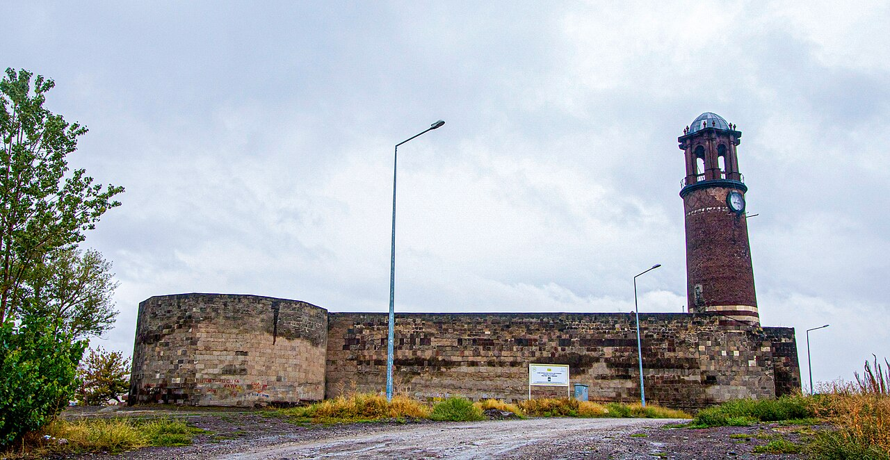

# 📍 Erzurum - Seyahat ve Tefekkür Notları

## 📜 Şehrin Ruhu
> "Çifte Minareli Medrese'nin taş kemerleri, tarihin vakur soğuğuna inançla meydan okuyan sarsılmaz birer kaledir."
> "Palandöken'in karlı zirvelerinden, ulu medreselerin taş oymalarına uzanan, bozkırın vakur ve yiğit dadaşlar diyarı."

### 🌍 Şehrin Dokusu ve Hatırası
Anadolu'nun en yüksek ve köklü kentlerinden biri, dadaşlık kültürünün ve kış sporlarının merkezi Erzurum. Çifte Minareli Medrese, Yakutiye Medresesi, Ulu Camii ve Erzurum Kongre Binası ile burası Türk-İslam mimarisinin zirve noktasıdır. Palandöken Dağı'nın eteklerinde kurulu şehir, kışın kar beyazı, yazın ise serin bozkır havasıyla gezginleri karşılar.

### 🕊️ Gezginin Not Defterinden (İçsel Düşünceler)
Çifte Minareli Medrese'nin taç kapısındaki hayat ağacı ve çift başlı kartal kabartmalarını incelemek, Türk mitolojisiyle İslam tasavvufunun taşta birleşen derin manasını düşünmeye sevk eder. Palandöken'in karlı yamaçlarından şehre bakarken çöken soğuk ayaz, insanın içindeki manevi sıcaklığı daha çok hissetmesini sağlar. Cağ kebabının ocaktaki ateşi, sabırla pişen nefsin simgesidir.

### 🍽️ Yöresel Lezzet Tavsiyeleri
- **Cağ Kebabı:** Kuzu etinin soğan ve reyhanla marine edilip yatık şişte odun ateşinde pişirilmesi.
- **Kadayıf Dolması:** Kadayıf tellerinin ceviz dolgusuyla sarılıp kızartılarak şerbetlenmesi.
- **Erzurum Ketesi:** Kat kat yağlanmış hamurun fırınlanmasıyla yapılan unlu kete.

### ⛺ Konaklama ve Bütçe Stratejisi
- **Sıfır Konaklama Maliyeti:** GSB Seyahatsever projesi kapsamında şehirdeki KYK yurtlarında 5 gün ücretsiz konaklanmıştır.
- **Ulaşım Optimizasyonu:** Bir önceki ilden rotaya devam edilerek yol masrafı minimize edilmiştir.

### 💻 Yarı Göçebe Mesaisi (Upskilling)
- **Kütüphane Rutini:** Gündüzleri İl Halk Kütüphanesinde zaman geçirilerek yazılım projeleri geliştirilmiş ve eğitimlere devam edilmiştir.
  * *Seyyahın Kütüphane Notu:* Erzurum Erzurumlu Emrah İl Halk Kütüphanesi - Tarihi dokusuyla dadaşların vakur çalışma disiplinini yansıtan sessiz çalışma limanı.
- **Şehri Sindirme:** Kalan vakitlerde şehrin tarihi ve kültürel dokusu acele etmeden, derinlemesine keşfedilmiştir.

### ✨ Keşfedilesi Duraklar
Bu şehrin havasını solumak, ruhuna dokunmak için mutlaka adımlanması gereken köşe taşları:
- [ ] **Çifte Minareli Medrese**
- [ ] **Yakutiye Medresesi**
- [ ] **Palandöken Kayak Merkezi**
- [ ] **Erzurum Kalesi ve Üç Kümbetler**
- [ ] **Erzurum Kongre Binası**
- [ ] **Tarihi Erzurum Evleri**

---
*Bu il bizzat deneyimlenmiş, yolları aşındırılmış ve seyahatnameye sevgiyle işlenmiştir.* ✅
