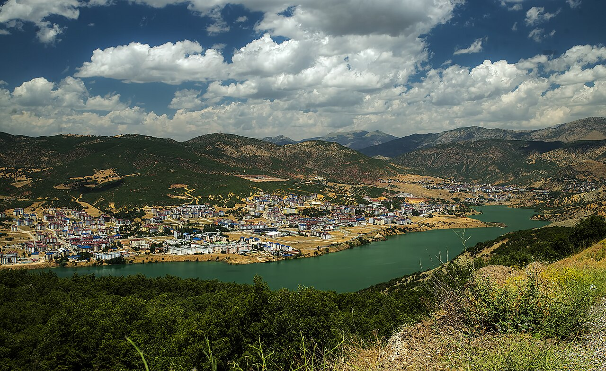

# 📍 Tunceli - Seyahat ve Tefekkür Notları

## 📜 Şehrin Ruhu
> "Munzur'un hırçın köpüklü suları, dağların derinliklerinden gelen en saf ve temiz yaşam energisidir."
> "Munzur Dağları'nın geçit vermez zirvelerinde, hırçın nehirlerin ve kutsal gözelerin sarmaladığı gizemli coğrafya."

### 🌍 Şehrin Dokusu ve Hatırası
Tunceli, sarp dağların, kanyonların ve akarsuların çevrelediği, doğanın en bakir kaldığı Doğu Anadolu ilidir. Kutsal kabul edilen Munzur Gözeleri, Munzur Vadisi Milli Parkı ve Munzur Çayı rafting parkurları ile burası doğa severler için eşsizdir. Alevi-Bektaşi kültürünün en yoğun yaşandığı, doğaya ve canlıya derin bir saygının hakim olduğu mistik bir atmosfere sahiptir.

### 🕊️ Gezginin Not Defterinden (İçsel Düşünceler)
Munzur Gözeleri'nde kayaların arasından fışkıran buz gibi suların sesini dinlemek, yaşam pınarının ve ilahi yaratılışın durmaksızın fışkıran enerjisini hissetmektir. Yöre halkının dağ keçilerini kutsal sayması, doğadaki tüm canlılarla barış içinde yaşama felsefesinin en asil tezahürüdür. Dağların doruklarına çöken sis, insanın içsel dünyasındaki sır perdelerini aralaması için tefekkür imkanı sunar.

### 🍽️ Yöresel Lezzet Tavsiyeleri
- **Munzur Sarımsaklı Tunceli Kavurması:** Munzur dağlarından toplanan yabani sarımsaklarla tatlandırılan kuzu eti.
- **Zerefet (Babuko):** Fırında pişen sert hamurun içinin oyulup, tereyağı ve sarımsaklı yoğurt dökülerek yendiği yemek.
- **Dut Pekmezi ve Pülümür Balı:** Tamamen organik çiçeklerden elde edilen şifalı bal.

### ⛺ Konaklama ve Bütçe Stratejisi
- **Sıfır Konaklama Maliyeti:** GSB Seyahatsever projesi kapsamında şehirdeki KYK yurtlarında 5 gün ücretsiz konaklanmıştır.
- **Ulaşım Optimizasyonu:** Bir önceki ilden rotaya devam edilerek yol masrafı minimize edilmiştir.

### 💻 Yarı Göçebe Mesaisi (Upskilling)
- **Kütüphane Rutini:** Gündüzleri İl Halk Kütüphanesinde zaman geçirilerek yazılım projeleri geliştirilmiş ve eğitimlere devam edilmiştir.
  * *Seyyahın Kütüphane Notu:* Tunceli İl Halk Kütüphanesi - Munzur nehrinin esintisiyle serinleyen, sessiz çalışma ortamı ve güler yüzlü çalışanlarıyla butik kütüphane.
- **Şehri Sindirme:** Kalan vakitlerde şehrin tarihi ve kültürel dokusu acele etmeden, derinlemesine keşfedilmiştir.

### ✨ Keşfedilesi Duraklar
Bu şehrin havasını solumak, ruhuna dokunmak için mutlaka adımlanması gereken köşe taşları:
- [ ] **Munzur Gözeleri**
- [ ] **Munzur Vadisi Milli Parkı**
- [ ] **Pülümür Çayı ve Kanyonu**
- [ ] **Kutudere Mesire Alanı**
- [ ] **Halbori Gözeleri**
- [ ] **Pertek Kalesi**

---
*Bu il bizzat deneyimlenmiş, yolları aşındırılmış ve seyahatnameye sevgiyle işlenmiştir.* ✅
