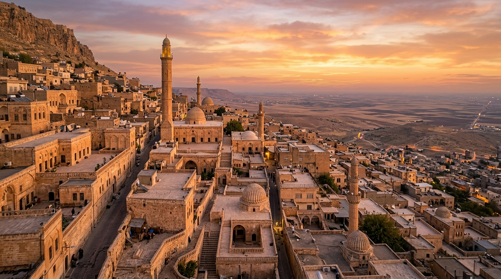

# 📍 Mardin - Seyahat ve Tefekkür Notları

## 📜 Şehrin Ruhu
> "Gecesi gerdanlık, gündüzü mezarlık olan bu taş şehir, ölüm ile yaşamın en estetik buluşma noktasıdır."
> "Mezopotamya ovasına tepeden bakan, sarı kalker taşından oyulmuş masalsı ve kadim bir medeniyet kalesi."

### 🌍 Şehrin Dokusu ve Hatırası
Tarihin ve dinlerin harmanlandığı, taşın dile geldiği kadim Mezopotamya şehri. Mardin, daracık abbaraları (tünelli geçitler), göğe yükselen minareleri ve manastır kuleleri ile zamana meydan okuyan sarı taş bir masaldır. Kasımiye Medresesi'nin avlusundaki havuzda akan suyun hikayesi, insan ömrünün aşamalarını (doğum, gençlik, yaşlılık ve ölüm sonrası) sembolize eder. Akşamları ovaya çöken karanlıkla birlikte ışıldayan şehir, Mezopotamya ovasının üzerinde parıldayan asil bir gerdanlık gibi görünür.

### 🕊️ Gezginin Not Defterinden (İçsel Düşünceler)
Kasımiye Medresesi'ndeki su akan çeşmenin başında oturup suyun akışını izlemek, hayatın geçiciliğini ve en sonunda dingin bir havuzda (ahirette) toplanacağını tefekkür etmek için muazzam bir fırsattır. Süryani manastırı Deyrulzafaran'ın bin yıllık taşlarında yankılanan dualar, inancın dilleri ve zamanı aşan ortak tınısını hatırlatır. Mardin'in dar sokaklarında kaybolmak, aslında insan yapımı sınırların anlamsızlığını ve insanlığın kadim ortak kökenini kavramaktır.

### 🍽️ Yöresel Lezzet Tavsiyeleri
- **Mardin İçli Köftesi (İrok):** Baharatlı kıyma ve ceviz dolgulu, dışı çıtır bulgurlu kızartma başyapıtı.
- **Kaburga Dolması:** Kuzu kaburgasının iç pilavla doldurularak saatlerce buharda pişirilen bayram yemeği.
- **Süryani Çöreği:** Mahlep, zencefil ve tarçın kokulu, hurma dolgulu nefis çörek.

### ⛺ Konaklama ve Bütçe Stratejisi
- **Sıfır Konaklama Maliyeti:** GSB Seyahatsever projesi kapsamında şehirdeki KYK yurtlarında 5 gün ücretsiz konaklanmıştır.
- **Ulaşım Optimizasyonu:** Bir önceki ilden rotaya devam edilerek yol masrafı minimize edilmiştir.

### 💻 Yarı Göçebe Mesaisi (Upskilling)
- **Kütüphane Rutini:** Gündüzleri İl Halk Kütüphanesinde zaman geçirilerek yazılım projeleri geliştirilmiş ve eğitimlere devam edilmiştir.
  * *Seyyahın Kütüphane Notu:* Mardin İl Halk Kütüphanesi - Taş mimarisi ve Mezopotamya ovasına bakan avlusuyla seyyah yazılımcıya ilham kaynağı.
- **Şehri Sindirme:** Kalan vakitlerde şehrin tarihi ve kültürel dokusu acele etmeden, derinlemesine keşfedilmiştir.

### ✨ Keşfedilesi Duraklar
Bu şehrin havasını solumak, ruhuna dokunmak için mutlaka adımlanması gereken köşe taşları:
- [ ] **Eski Mardin Sokakları ve Abbaralar**
- [ ] **Deyrulzafaran Manastırı**
- [ ] **Kasımiye Medresesi**
- [ ] **Dara Antik Kenti**
- [ ] **Mardin Ulu Camii**
- [ ] **Zinciriye Medresesi**

---
*Bu il bizzat deneyimlenmiş, yolları aşındırılmış ve seyahatnameye sevgiyle işlenmiştir.* ✅
