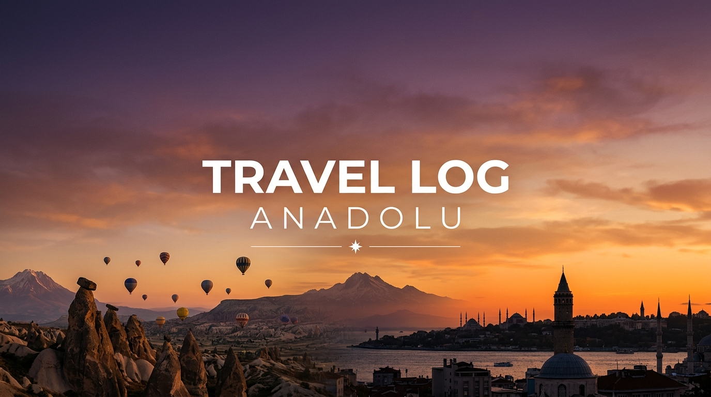

<p align="center">
    
</p>

<p align="center">
    <!-- Dynamic Badges -->
    <a href="https://resilient-semifreddo-6651ec.netlify.app/" target="_blank"></a>
    
    
    
    
    <br><br>
    <strong>🦅 "Yeni ufuklara yelken açan gezginlerin izinde..."</strong>
</p>

---

<div align="center">
  <h3>🌍 SEYAHAT SEVER VİZYONU (vPRO)</h3>
  <p><em>"Biz, yolların bitmediği, keşfin son bulmadığı bir dünyanın yolcularıyız. Her durak yeni bir hikaye, her şehir içsel bir tefekkürdür. Bu repo, <strong>yollara sevdalı bir seyyahın</strong> dijital hafızasıdır."</em></p>
</div>

---

# 🇹🇷 TRAVEL LOG: ANADOLU SEYAHATNAMESİ

<div align="center">
  
> *"Dünya bir kitaptır ve seyahat etmeyenler onun sadece bir sayfasını okur."* <br> — **Aurelius Augustinus**
>
> *"İyi bir gezginin sabit planları ve varmak gibi bir amacı yoktur."* <br> — **Lao Tzu**
>
> *"Yolculuk, önce seni sessizleştirir, sonra da iyi bir hikâye anlatıcısına dönüştürür."* <br> — **İbn Battuta**
>
> *"Gerçek keşif yolculuğu yeni manzaralar bulmak değil, yeni gözlerle bakmaktır."* <br> — **Marcel Proust**
>
> *"Her şeyden önce gezgin olunmalı; dünya ancak o zaman gerçekten hissedilir."* <br> — **Mevlana Celaleddin-i Rumi**
>
> *"Kıyıyı gözden kaybetmeye cesaret edemeyenler, yeni okyanuslar keşfedemezler."* <br> — **Andre Gide**
>
> *"Yollar, sadece ayakların değil, zihnin de özgürleştiği patikalardır."* <br> — **Friedrich Nietzsche**
>
> *"Gezgin, vardığı yerdeki her taşı bir anı, her insanı bir öğretmen gibi selamlar."* <br> — **Hint Özdeyişi**

</div>

## 📜 Dijital Seyahatname Manifestosu

Bu repo, Anadolu'nun kadim yollarını adımlayan bir **seyyahın dijital seyir defteridir.**  Amacımız sadece "nereleri gördüğümüzü" kaydetmek değil; o coğrafyanın tarihini, kültürünü ve ruhumuza kattığı evrensel farkındalığı kaleme almaktır.

*   **Derinlik:** Yüzeysel turizmden ziyade, gidilen her yerin tarihsel bağlamını, toprağın ve taşın hikayesini anlamak. 
*   **İçsel Yolculuk:** Doğaya, asırlık kültürlere ve farklı yaşanmışlıklara aynı saygıyla yaklaşarak, her seyahati içsel bir tefekküre dönüştürmek.
*   **Açık Miras:** Edindiğimiz edinimleri, rotaları ve notları yollara sevdalı diğer yolcularla "açık kaynak" olarak paylaşmak.

---

<p align="center">
    
    <br>
    <em style="display: block; text-align: center; font-size: 11px; color: #888;">"Kapadokya'nın masalsı vadilerinde zamanı ve mekânı unutuş..."</em>
</p>

---

## 🎒 Seyahat Metodolojisi: "Yarı Göçebe, Tam Seyyah"

Bu seyir defteri rastgele bir turistik gezinin değil, net bir **Seyahat Disiplini**'nin ürünüdür. Seyahatlerimiz, T.C. Gençlik ve Spor Bakanlığı'nın sunduğu **"Seyahatsever"** projesi ekseninde, sırt çantalı bir *dijital göçebe (digital nomad)* mantığıyla kurgulanmıştır:

*   **Süre ve Rota Stratejisi:** Her yaz dönemi, 45 günlük kesintisiz bir rota oluşturulur. Bu rotada **komşu iller sırasıyla takip edilerek** hem yol maliyeti minimuma çekilir hem de seyahat yorgunluğunun (travel fatigue) önüne geçilir. Bu lojistik optimizasyon, yolda geçen süreyi azaltıp, keşfe ve gelişime ayrılan süreyi artırır.
*   **Konaklama Stratejisi (Düşük Bütçeli / Bütçesiz Seyahat):** Gidilen her ilde, **GSB Seyahatsever** projesi kapsamında **KYK yurtlarına** yerleşilir. Seyahatin en büyük maliyet kalemi olan konaklamanın sıfırlanması, kısıtlı bir bütçeyi hatta "olmayan bütçeyi" dahi muhafaza ederek uzun süreli seyahat etme imkanı sunar. Bu strateji, bütçeyi harcamak değil, bütçesizliğin içinde sürdürülebilir bir keşif rotası oluşturmak üzerinedir.
*   **5 Gün Kuralı:** Her şehirde tam olarak **5 gün** kalınır. Bu süre, şehri sadece tüketmek için değil, sindirmek için belirlenmiş bir standarttır. Aynı zamanda sürekli yer değiştirmenin önüne geçilerek yol masrafları da minimize edilir.
*   **Yarı Mesai Sistemi (Gelişim & Keşif):** Seyahat ederken kişisel gelişim ve üretim durmaz. Günün **ilk yarısı**, o şehrin merkezindeki bir kütüphanede (İl Halk Kütüphaneleri vb.) geçirilerek; kodlama öğrenme, ders çalışma, sertifika toplama ve dijital projeler üretme gibi "upskilling" odaklı faaliyetler gerçekleştirilir. Günün **ikinci yarısı** ise şehrin ruhuna karışmaya ayrılır.

Bu disiplin, seyahati bir "tüketim" aktivitesinden çıkarıp, **ekonomik, sürdürülebilir ve üretken bir yaşam tarzı** haline getirir.

### 💻 Dijital Göçebe Kütüphane Rutini
Seyahat ederken üretken kalmanın sırrı, katı bir zaman yönetimidir. Günün ilk ışıklarıyla başlayan bu rutin, yolları bir kaçış değil, bir gelişim okulu haline getirir:
* **08:30 - 09:00 | Kütüphaneye İntikal:** Gidilen şehrin İl Halk Kütüphanesi veya belediye kütüphanesine gidilir.
* **09:00 - 13:00 | Blok Çalışma (Upskilling):** Kesintisiz 4 saatlik odaklanma. İnternet erişimi ve sessiz çalışma ortamı kullanılarak yazılım geliştirme (Python, Web geliştirme vb.), algoritma çalışmaları ve makaleler yazılır.
* **13:00 - 14:00 | Öğle Molası ve Lojistik Planlama:** Yerel esnaf lokantalarında bütçe dostu bir öğle yemeği ve o gün keşfedilecek tarihi/kültürel noktaların koordinatlarının çıkarılması.
* **14:00 - 20:00 | Coğrafi ve Kültürel Keşif:** Şehrin sokaklarına, müzelerine, antik harabelerine veya doğal güzelliklerine karışma. Yerel halkla sohbet, gezi günlüğü için fotoğraf çekimi ve ses kaydı/not alma.
* **20:00 - 22:00 | KYK Yurt Rutini:** Alınan notların dijitalleştirilmesi, seyahatname dosyalarının (README.md) güncellenmesi ve `git push` ile buluta yedeklenmesi.

### 🎒 Seyyahın Heybesi (Sırt Çantası Ekipmanları)
45 gün boyunca tek bir sırt çantasıyla (50-60 Litre) seyahat edebilmek, sadeleşmenin en somut halidir. Heybemizdeki tech-gear ve hayatta kalma araçları:
* **Teknoloji Bölmesi (Tech Gear):**
  * **Taşınabilir Bilgisayar (Laptop):** Kod yazmak ve notları derlemek için hafif ve pil ömrü uzun bir cihaz.
  * **Powerbank & Çoklu Şarj Adaptörü:** Yolda ve otobüslerde şarj sıkıntısı yaşamamak için 20.000 mAh destekli batarya ve hızlı şarj başlığı.
  * **Kablolu Kulaklık:** Kütüphane ortamında gürültüyü engellemek ve odaklanmak için.
  * **Evrensel Adaptör / Uzatma Kablosu:** KYK yurtlarındaki tek priz kısıtlamasını aşmak için 3'lü priz.
* **Hayatta Kalma & Konaklama Bölmesi:**
  * **Kişisel Nevresim / Yastık Kılıfı:** KYK yurtlarında hijyeni garantiye almak için ultra hafif mikrofiber kılıflar.
  * **Mikrofiber Havlu:** Hızlı kuruyan ve sırt çantasında yer kaplamayan özel dokuma havlu.
  * **Termos / Matara:** Kütüphanede çay/kahve ve yolda su ihtiyacı için ısı yalıtımlı çelik termos.
  * **Sırt Çantası Yağmurluğu:** Beklenmedik hava muhalefetlerine karşı çantayı ve teknolojik aletleri korumak için.

---

## 🛠️ Kurulum (Quick Start)

Bu efsanevi ağı bilgisayarınızda çalıştırmak için:

```bash
# Reposu klonlayın
git clone https://github.com/bahattinyunus/travel.log.git
cd travel.log

# Bağımlılıkları tek seferde kurun (Rich, Folium, Pandas)
pip install -r requirements.txt

# Sihirbazı Başlatın!
python cli.py
```

## 🎮 Komuta Merkezi Kullanımı

Terminalinize sadece `python cli.py` yazın ve arkanıza yaslanın.

1. **📝 New Entry:** Hızlıca haritaya yeni bir feth edilmiş bölge ekleyin. Klasör hiyerarşisi otomatik oluşur.
2. **🗺️ Update Interactive Map:** Koordinatları analiz edip `travel_map.html` dosyasını sıfırdan çizer.
3. **📊 Quantum Dashboard:** Toplam istatistikleri ve vizyon haritasını konsola yansıtır.

---

<p align="center">
    
    <br>
    <em style="display: block; text-align: center; font-size: 11px; color: #888;">"Asırların iç içe geçtiği, iki kıtanın secdesi İstanbul..."</em>
</p>

---

## ⚡ Yeni Nesil Özellikler (vPRO Features)

Web platformumuz, seyahat tecrübesini dijital dünya ile kusursuzca birleştirmek amacıyla aşağıdaki modern özelliklerle donatılmıştır:

*   **📊 İnteraktif Gösterge Paneli (Dashboard):** 81 il üzerindeki ilerlemeniz, bölgesel keşif oranları, tahmini seyahat süresi, kütüphane çalışma saatleri ve GSB Seyahatsever/KYK konaklama tasarruflarını tek ekranda sunan premium landing page.
*   **🗺️ Google Haritalar & Canlı Koordinat Entegrasyonu:** Şehirlerin tam enlem ve boylam koordinatları üzerinden tek tıkla Google Haritalar'a yönlendirme.
*   **📜 Sekmeli Şehir Portreleri:** Şehir detaylarını kalabalıklaştırmadan sunan *Portre, Keşif Rotaları, Yöresel Lezzetler* ve *Manevi Seyir* sekmeleri.
*   **🎯 İnteraktif Durak/Mekan Takibi:** Lokasyon bazlı durakların (landmarks) tarayıcı hafızalı (`localStorage`) checkbox sistemi ile anlık olarak tamamlanma durumunun takibi ve ilerleme çubuğu.
*   **💎 Premium Tasarım Dili (Glassmorphic):** Outfit ve Inter modern yazı tipleri, neon radial ışıma efektleri, yumuşak geçişler ve tam duyarlı (responsive) mobil uyumlu arayüz.

---

## 🗺️ Derinlemesine Keşfedilen Menziller (Unveiled Destinations)

Anadolu'nun dört bir yanında adımladığımız, tarihi ve kültürel izleri takip ettiğimiz **37 eşsiz şehir** ve keşif durakları:

*   **🏰 İmparatorluklar Beşiği (Marmara):** İstanbul'un (Ayasofya, Galata) o manevi ve tarihi atmosferinden; Bursa'nın yeşil sükûnetine ve Osmanlı'nın kurucu iradesine tanıklık...
*   **🌲 Doğanın ve Kararlılığın Sesi (Karadeniz):** Amasya'da Ferhat'ın dağı delen aşkının ardındaki hakikati aramaktan; Karadeniz sahilinin yeşille maviyi kucaklayan zikrine karışmaya... Trabzon'un sisli yamaçlarındaki kartal yuvası Sümela Manastırı'nda inancın gücünü görme...
*   **🌾 Bozkırın Dingin Ruhu (İç Anadolu):** Konya'da Celaleddin Rumi'nin felsefe ve hoşgörü ocağından geçerek; Ankara'nın Cumhuriyet'in temellerini atan vakur duruşunu hissetmeye... Nevşehir/Kapadokya'da peri bacalarının rüzgarla fısıldaşmasını tefekkür etme... Kayseri'de Erciyes'in gölgesindeki Selçuklu mirasını adımlamak ve Kırşehir'de ulu ozanların sazıyla yankılanan bozkırın manevi sesine kulak vermek...
*   **🌊 Antik Kodların Fısıltısı (Akdeniz & Ege):** Antalya'nın kadim taşlarında asırların geçiciliğini okumaktan; Denizli'nin şifalı doğası ve tarihi dokusuyla iç içe geçmeye... Muğla'da turkuaz suların zümrüt ormanlarla seviştiği koylardan Kayaköy'ün hüzünlü hayalet sokaklarına uzanan yolculuk... Mersin'de denizin ortasındaki Kızkalesi'nden Cennet-Cehennem obruklarının serin derinliklerine inme...

> *"Bütün yolculukların gizli bir amacı vardır ve yolcunun bundan haberi bile yoktur."* — **Martin Buber (Yahudi Düşünür)**

---

<p align="center">
    
    <br>
    <em style="display: block; text-align: center; font-size: 11px; color: #888;">"Akdeniz'in antik kodlarını taşıyan sıcacık limanı Antalya..."</em>
</p>

---

## ✅ 81 İl Keşif Haritası

**🏆 Genel İlerleme:** %45.7 (37 / 81 İl)
🟩🟩🟩🟩🟩🟩🟩🟩🟩⬜⬜⬜⬜⬜⬜⬜⬜⬜⬜⬜

> *Sürücü koltuğunda bizzat geçilen ve anı biriktirilen eşsiz rotalar...*

**🏰 Marmara Bölgesi (3/11)**
- ❌ Balıkesir
- ❌ Bilecik
- ✅ **Bursa**
- ❌ Edirne
- ✅ **Kocaeli**
- ❌ Kırklareli
- ❌ Sakarya
- ❌ Tekirdağ
- ❌ Yalova
- ❌ Çanakkale
- ✅ **İstanbul**

**🌊 Ege Bölgesi (2/8)**
- ❌ Afyonkarahisar
- ❌ Aydın
- ✅ **Denizli**
- ❌ Kütahya
- ❌ Manisa
- ✅ **Muğla**
- ❌ Uşak
- ❌ İzmir

**☀️ Akdeniz Bölgesi (5/8)**
- ✅ **Adana**
- ✅ **Antalya**
- ❌ Burdur
- ✅ **Hatay**
- ✅ **Isparta**
- ❌ Kahramanmaraş
- ✅ **Mersin**
- ❌ Osmaniye

**🌾 İç Anadolu Bölgesi (8/13)**
- ✅ **Aksaray**
- ✅ **Ankara**
- ✅ **Eskişehir**
- ❌ Karaman
- ✅ **Kayseri**
- ✅ **Konya**
- ✅ **Kırıkkale**
- ❌ Kırşehir
- ✅ **Nevşehir**
- ❌ Niğde
- ✅ **Sivas**
- ❌ Yozgat
- ❌ Çankırı

**🌲 Karadeniz Bölgesi (11/18)**
- ✅ **Amasya**
- ✅ **Artvin**
- ❌ Bartın
- ✅ **Bayburt**
- ❌ Bolu
- ❌ Düzce
- ✅ **Giresun**
- ✅ **Gümüşhane**
- ❌ Karabük
- ❌ Kastamonu
- ✅ **Ordu**
- ✅ **Rize**
- ✅ **Samsun**
- ✅ **Sinop**
- ❌ Tokat
- ✅ **Trabzon**
- ❌ Zonguldak
- ✅ **Çorum**

**🏔️ Doğu Anadolu Bölgesi (8/14)**
- ✅ **Ardahan**
- ✅ **Ağrı**
- ❌ Bingöl
- ❌ Bitlis
- ✅ **Elazığ**
- ✅ **Erzincan**
- ✅ **Erzurum**
- ❌ Hakkari
- ❌ Iğdır
- ✅ **Kars**
- ✅ **Malatya**
- ❌ Muş
- ✅ **Tunceli**
- ❌ Van

**🏜️ G.Doğu Anadolu Bölgesi (0/9)**
- ❌ Adıyaman
- ❌ Batman
- ❌ Diyarbakır
- ❌ Gaziantep
- ❌ Kilis
- ❌ Mardin
- ❌ Siirt
- ❌ Şanlıurfa
- ❌ Şırnak

## 🧬 Kavramsal ve Teknik Mimari (System Architecture)
Bu seyir defteri, hem felsefi hem de dijital bir temele oturtulmuştur. Teknik altyapı, seyyah vizyonuna hizmet edecek şekilde tasarlanmıştır:

### 🗄️ Veri Mimarisi
*   `[01-07]_Regions/`: Anadolu'nun 7 rengi. Verinin fiziksel olarak depolandığı ana klasörler.
*   `analytics.py` ( Quantum Dashboard ): Bütün gezilen rotaları anlık tarayan, saniye saniye keşif grafikleri çizen analitik motoru.
*   `cli.py` ( Seyahatname vPRO ): Gezginin ana komuta merkezi. Tüm girişler ve harita güncellemeleri bu interaktif arayüzden yönetilir.
*   `map_generator.py`: Koordinatları ve kültürel notları interaktif bir **Folium HTML haritasına** işleyen haritacı.
*   `.github/workflows`: Biz uyurken dahi, depoya düşen her yeni rotayı otomatik olarak analiz edip haritayı güncelleyen sistem (CI/CD Otomasyonu).
*   `_Sablon/`: Her rotaya aynı özenle veri girmek için hazırlanmış standart şablonlar.

### 🧭 7 Bölgenin Kültürel ve Doğal Dokusu
*   **Marmara**: *Tohum ve Cihan.* Bir imparatorluğun doğduğu, iki kıtaya uzanan köprülerin sınandığı tarihi kilit taşı.
*   **Ege**: *Zamanın Çizgileri.* Antik mermerlere işlenmiş detaylardan bugüne uzanan, suyun kayayı sabırla oyduğu topraklar.
*   **Akdeniz**: *Sıcaklık ve Liman.* Torosların heybetiyle binlerce yıllık limanları sinesine çeken, yorgun denizcilerin sığınağı.
*   **İç Anadolu**: *Bozkırın Kalbi.* Dışarıdan kurak görünen ama bağrında medeniyetleri, ulu ozanları ve bilgeliği saklayan tevazu yurdu.
*   **Karadeniz**: *Dalga ve Orman.* Hırçın dalgaların yemyeşil ormanlarla kucaklaştığı, insanın doğayla inatçı ve bitimsiz mücadelesinin resmi.
*   **Doğu Anadolu**: *Zirvelerin İhtişamı.* Zorlu iklimlerde pişen hayatların soğuğa karşı geliştirdiği sade ve sarsılmaz direnç.
*   **Güneydoğu Anadolu**: *Mezopotamya'nın Ninnisi.* İnsanlığın beşiği. Toprağın taşa, taşın efsaneye dönüştüğü masalsı coğrafya.

## 🤝 Katkıda Bulunma (Contributing)
Bu proje açık kaynaklı bir mirastır. Lütfen `CONTRIBUTING.md` dosyasını inceleyin.

---
<p align="center">
    <sub>Generated by Intelligence " 2024</sub>
</p>
